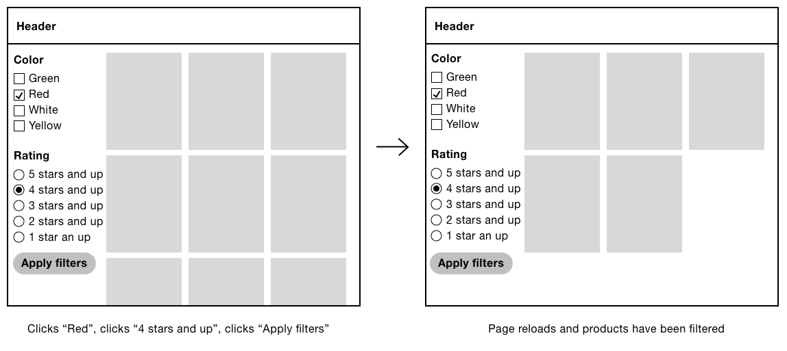
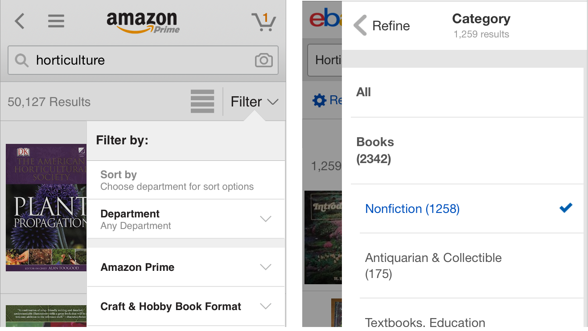

# A Filter Form

In the introduction to “A Search Form”, you'll recall the type of conversation I used to have with Mum. Sometimes I would ask “Where's my black top?”. But this was so vague that Mum would respond with questions like “Is it a football or tennis top?”. This question is a filter on a large set of results. Without knowing the answer to this question, Mum couldn’t respond with an accurate answer.

On the web, filters, also referred to as facet navigation or guided navigation, lets users refine a large set of search results. The purpose of which is to help users narrow in on what they’re looking for.

First of all, though, it must be said that if you don't need a filter, don't include one. They're only useful if searching returns a vast amount of results. In the case of Google where searching can yield thousands, if not, millions of results, most people aren't willing to click beyond the first or second page.

Letting users filter out irrelevant results is important. The ability to filter not only offers an additional dimension of control, but it does so in a way that matches each users’ own mental model. In “Designing for Faceted Search”[^faceted search], Stephanie Lemieux says:

> Think of a cookbook: authors have to organize the recipes in one way only — by course or by main ingredient — and users have to work with whatever choice of organizing principle that has been made, regardless of how that fits their particular style of searching. An online recipe site using faceted search can allow users to decide how they’d like to navigate to a specific recipe [by course type, cuisine or cooking method, for example].

On first glance, filters may look similar across different sites, but their behaviour varies quite widely. When and how should filters be applied, how to denote selected filters, what elements should be used, how to give users feedback, how they’ll work on mobile and desktop: all of these things need to be taken into account.

## Interactive Filters Versus Batch Filters

There are two ways to let users filter: one at a time (interactive filtering) or selecting multiple filters at once (batch filtering). In “User Intent Affects Filter Design”[^], Katie Sherwin, describes an excellent way to think about this:

> […] think about how you might order appetizers at a restaurant. Say you want to order three appetizers for the table, but as soon as you name the first one, the waiter snatches the menu out of your hands and walks back to the kitchen to get the chefs started on cooking that dish. 

> Instead, a good waiter understands that you’re still in the process of ordering and knows to give you more time before taking away the menu.  A good waiter **allows you time to** **make a batch decision**, even if that might slightly delay the delivery of the first item ordered. 

> (However, sometimes the waiter may take the appetizer order, and then give you more time to decide on the main course. A good waiter is flexible and adapts to the needs of the customers.)

### Interactive Filters

Interactive filters update as soon as the user clicks a filter. The advantage is that users will see the results update as they go.


One disadvantage is that each click causes a page refresh, which is particularly frustrating if users are likely to choose several filters.

### Batch Filters

Batch filters work by letting users choose a number of different filters, and then submitting them in one fell swoop. One advantage of this approach is that it’s faster, as users just make one request for several filters.



One disadvantage of this approach is that a combination of filters could lead to zero-results. 

### Materially Dishonest Interfaces

We’ve already discussed the concept of material honesty several times in the book. This is because, rather unfortunately, dishonest interfaces are prevalent on the web. As a reminder, one material shouldn’t be used as a substitute for another because the end result is deceptive. In short, we should use the right material for the job. But what does this mean with regards to filters?

As shown above, interactive filters tend to use links because they provide the expected behaviour—that clicking a filter immediately requests the new results. However, some sites style these links to look like checkboxes, by using CSS background images[^], for example. 


The problem is that a link should look (and behave) like a link—not a checkbox. Batch filters, made from real checkboxes, let users select several filters. Making links look like checkboxes would mean users wouldn’t expect clicking a filter would immediately request the new results. That’s materially dishonest and therefore deceptive.

But why would designers do this? One theory is that without making the links look like checkboxes, users wouldn’t know that they could choose multiple filters within the same category. Or, in the case of radio buttons, that they wouldn’t know that they could choose only one filter.

Breaking widely understood conventions without a very good reason can seriously harm the user experience. That’s all well and good as a theory, but how do we take this information and design a filter that works?

We'll find out by taking things step by step.

### Which Type Of Filter Is Best?

Only conducting your own research for your problem can tell you the answer to that, but we’ll go with batch filters. This seems prudent because:

- users can choose multiple filters at once creating a faster experience
- radio buttons and checkboxes have natural signifiers that indicates that one or multiple filters can be selected within the same category
- users can still, if they wish, select just one filter at a time with a batch filter, which speaks to principle 4, *Give control*.

## Layout


Before tackling the complexity of the filter form itself, it’s important to look at it in the context in which users are likely to use it. In modular design, we can fall prey to focusing so deeply on the individual components, that we forget to check how everything works when they combine to form the page (or journey).

In this case, the page has been carefully arranged so that the relationship between the filter and the products is clear. This has been achieved by using the correct heading levels:

1. The primary heading (level 1) is at the top: “Wallets”
2. Then there is a sub heading (level2) for each of component: “Filter” and “Products”.

Not only have we used the correct heading hierarchy (as we’ll see in the code to follow), but they are in the correct proportion and appropriately aligned and spaced to connect them together.

These subtle details are important, because not only does the filter let users find products more quickly, but it also provides context for the products in view.

## The Markup

As the form is made out of standard form components, the code for our filter form should be familiar.

```HTML
<main>
  <h1>Wallets</h1>
  <aside class="filter" aria-labelledby="filter-heading">
    <h2 id="filter-heading">Filters</h2>
    <form role="form" method="get" aria-labelledby="filter-heading?">
      <fieldset class="field">
        <legend>
          <span class="field-legend">Color</span>
        </legend>
        <div class="field-options">
          <div class="field-checkbox">
            <label for="color">
              <input type="checkbox" name="color" value="green" id="color">
              Green
            </label>
          </div>
          <div class="field-checkbox">
            <label for="things1">
              <input type="checkbox" name="color" value="red" id="color1">
              Red
            </label>
          </div>
          <!-- more checkboxes -->
      </div>
      </fieldset>
      <fieldset class="field">
        <legend>
          <span class="field-legend">Rating</span>
        </legend>
        <div class="field-options">
          <div class="field-radioButton">
            <label for="color">
              <input type="radio" name="rating" value="4" id="rating">
              4 stars and up
            </label>
          </div>
          <div class="field-radioButton">
            <label for="things1">
              <input type="radio" name="rating" value="3" id="rating1">
              3 stars and up
            </label>
          </div>
          <!-- more radio buttons -->
      </div>
      </fieldset>
      <!-- other filter categories -->
      <input type="submit" value="Apply filters">
    </form>
  </aside>
  <div class="results">
    <h2>Products</h2>
    <!-- products -->
  </div>
</main>
```

**Notes**

- There are 3 headings on the page: the top level (`<h1>Wallets</h1>`) and a level two heading for the filter and products components. Many sites provide an incomplete and broken heading structure—for example, by replacing `<h2>Products</h2>` with `<h1>Wallets</h1>` . However, this orphans the `<h2>Filter</h2>` which deceives both sighted and non-sighted users because users expect that a second level heading comes after the first.
- The specification has recently changed to allow headings inside legend elements. We could then consider marking up the text inside the legends as H3s. This would give screen reader users an alternative way to navigate the filter which is sometimes called multimodality and speaks to principle 5, Offer choice.
- Notice the form has a `role="form"` attribute. This may seem counterintuitive, but it turns the form into a landmark, which makes it navigable in screen readers using shortcuts. Since the basic functionality works without JavaScript and triggers a page refresh, this helps users navigate back to the form from the top of the document. It also means users can browse the products and still get back to the filter component quickly.
- Similarly, the filter is marked up as an `<aside>` which as another type of landmark, typically used to denote a sidebar. An aside should be tangentially related to the main content, which suits the filter component well.
- We’re using the get method on the form to rebuild the page from the server without relying on client-side JavaScript, at this stage. For example, submitting the form with the "Red" and “3 stars and above” options selected will build a page with `?color=red&rating=3` as the query parameter. We’ll look at enhancing the page with AJAX later.
- The form contains a number of fields which have been included for example purposes. The type of form control you use, should be based on the type of behaviour your users need. As noted in previous chapters, checkboxes should be used for multiple selections; radio buttons if only one can be selected.
- Keyboard users can use the arrow keys (left and right, up and down) for selecting a radio button.  Pressing the down arrow key, for instance, will focus and select the next radio button with the `name="rating"` attribute—“3 stars and up.” In screen readers this will announce “rating, three stars and up, selected, radio button, two of four” (or similar). 

## Automatic submission

As noted above, the filter form (like any other form, I might add), lets users select as many filters as they like before submitting them. This standard and conventional behaviour should be familiar to users, except this is not always the case. 

I interviewed David House, a former designer for Gumtree[^], a site which uses filters extensively. As such, David and his team did many rounds of usability tests and here’s what he said:

> On desktop, Gumtree users would select filters without submitting them. They didn't realise they had to submit their choices. We got a lot of feedback saying “Your filters are broken.”

Due to the materially dishonest design of filters as explained earlier, it seems some people have come to expect that clicking a checkbox (or radio button), will reload the results without having to submit.

Automatically submitting the form when a filter is selected would effectively convert our batch filter into an interactive one. That's a shame as not only would we be exacerbating the problem of dishonest design, but we’d be forgoing the inherent advantages of batch filters.

And this may work for radio buttons and checkboxes, but what if there were text boxes that could be used to enter a price range? When would users expect the form to submit? Submitting while typing is out of the question. This leaves submitting the form `onblur` (tabbing or clicking out of the field) which is odd and unintuitive. We'd need a submit button just for that box.

If your users have the same expectations as Gumtree’s users, then you may have no choice. But, before going to such lengths, lets explore some other techniques to help users realise that submission is necessary. 

First, the button should look like a button and be styled prominently to stand out on the page. And second, the button should be within easy reach (within reason). Some options include:

- Making each filter category collapsible (we’ll look at how to do this later)
- Duplicate the submit button at the top of the form
- Consider making the buttons stay on screen by using position: sticky[^].
## Should We Just Change To Links?

Perhaps we should just throw away the form and use links. The advantage of which is that we wouldn’t need JavaScript—users would get standard and expected (link) behaviour, for free.

But there are several disadvantages:

- We can’t use links for the dynamic price range inputs, for example, which is unnecessarily constraining.
- We may need to signify the “select one” or “select multiple” behaviour across different link filters, which is challenging without making links look like checkboxes (here we go again).
- If users select many filters then they may exceed the max limit of the querystring. Posting a form averts this problem.

Really, we’re exchanging one set of problems for another, arguably larger set. Let’s see how we can submit the form automatically using JavaScript and the issues that may arise from doing so.

### Submitting The Form Automatically

If, despite our efforts to thwart breaking convention, users still expect the form to submit automatically, we can use Javascript to submit the form in response to the form’s change event. 

As our filter only contain checkboxes and radio buttons, we can first remove the now redundant submit button. However, we can’t completely remove the button from the document because some platforms (iOS for example) will not submit forms where a submit button isn’t present. In which case, we can use our special visually hidden class, plus tabindex="-1" to make sure the button isn’t user-focusable.

```JS
function FilterRequester() {
  this.form = $('.filter form');
  this.form.find('[type=submit]').addClass('visually-hidden').attr('tabindex', '-1');
}
```

Now the submit button’s been hidden accessibly, we can submit the form when a filter is changed by listening to the change event:

```JS
function FilterRequester() {
  //...
  this.form.find('[type=radio], [type=checkbox]').on('change', $.proxy(this, 'onInputChange'));
}

FilterRequester.prototype.onInputChange = function() {
  this.form.submit();
};
```

You should note that this fails Web Content Accessibility Guidelines Success Criteria 3.2.2[^]:

> Changing the setting of any user interface component does not automatically cause a change of context

Additionally, keyboard users operating the filters, must use their arrow keys to move through the radio buttons. Each arrow keypress not only focuses adjacent radio buttons but selects them as well. As a result keyboard users won’t be able to move more than one radio button at a time without the form being submitted. What if they wanted the third or fourth radio button?

Even if you ignore the difficulties associated with certain interaction modalities, having the page refresh in the middle of choosing filters is a poor user experience. Let’s see if AJAX can fix these issues.

## AJAX

AJAX is a technology that lets users dynamically update parts of an interface without a page refresh. The advantage, in this particular case, is that users can select as many filters as they like without being interrupted by a page refresh and the focus moving to the top of the document.

To do this, we can listen to the change event and fire off an AJAX request:

```JS
  FilterRequester.prototype.onInputChange = function() {
    var data = this.form.serialize();
    this.requestResults(data);
  };
  
  FilterRequester.prototype.requestResults = function(data) {
    $.ajax({ data: data, ...});
  }
```

While the main problem has been solved, the introduction of AJAX has created additional problems. Let’s discuss each of those now and see how we might deal with them.

### Communicating loading states

When a web page is loading, the web browser shows a loading indicator. This loading indicator is accurate, accessible and, as it’s part of the browser shell, it appears in the same place no matter the website making it trustworthy and familiar.

When AJAX is used we have to provide our own mechanism to inform users that the request is loading. This is normally the purview of a loading spinner.


But, you should note that, unlike the browser, it doesn’t tell users how long is left, or if the connection is slow. In the next chapter, we’ll look at ways to provide an accurate progress bar with AJAX.

Also, the loading spinner, in it’s current form, is only determinable by sighted users. To provide a comparable experience (principle 1) for screen reader users, we’ll employ a live region (as first set out in 2, “Checkout”).

```HTML
<div aria-live="assertive" role="alert" class="visually-hidden">Loading products.</div>
```

When the products are loaded:

```HTML
<div aria-live="assertive" role="alert" class="visually-hidden">Loading complete. 13 products listed.</div>
```

*(Note: as the loading spinner is enough communication for sighted users, the live region is given the special visually hidden class as set out in “Checkout”.)*

### Breaking the back button

When a user loads a web page the browser refreshes and puts the previous page into its history. This is so users can press the back button to go back to it quickly. But, when AJAX is used to make updates, it’s not put into the browser’s history. This is because the user hasn’t technically navigated to another page.

Even though users haven’t technically navigated to another page, if the page looks like it’s significantly changed, then users will expect the back button to work as normal. Baymard’s usability study[^] found that a breaking the back button behaviour, caused confusion, disappointment, anger and even abandonment.

This is the sort of thing that can happen with a little enhancement that breaks convention. This is why, the best experiences are usually the most simple.

Fortunately, we can use HTML5’s history API[^] which was designed to help solve this problem. First. we have to create a history entry when the AJAX request is made like this:

```JS
FilterRequester.prototype.onInputChange = function() {
  var data = this.form.serialize(); // color=red&rating=3
  this.requestResults(data);
  history.pushState(data, null, '/path/to/?'+data);
};
```

**Notes:**

- The first parameter is the state (or data) which we want to be stored with the history entry. In this case, it’s the user-chosen filters.
- The second parameter is the title. As it’s not well supported and it’s not necessary in our case, we’re ignoring it by passing null.
- The third parameter is the history’s URL, which is the URL including the querystring.

With this in place, we need to listen to when the history changes:

```JS
function FilterRequester() {
  //...
  $(window).on('popstate', $.proxy(this, 'onPopState'));
}

FilterRequester.prototype.onPopState = function(e) {
  this.requestResults(e.originalEvent.state);
};
```

**Notes:**

- The state property contains the data that we associated with the history entry on creation. It’s then passed onto the already written `requestResults` method so that it can be used to render the state using AJAX again.
- As we’re using jQuery to listen to the `onpopstate` event, the state (normally, `e.state`) property is found in `e.originalEvent.state`.

## Users might not notice the results update

Another problem with making updates with AJAX is ensuring that users notice the results update. Take a situation whereby the filter component is very long and scrolls beyond the fold. Imagine, that while selecting a filter toward the bottom, it returns too few results that the user sees a blank screen.


We can’t move focus as that defeats the entire point of introducing AJAX in the first place. There are a two ways we might solve this problem.

First, we can set a maximum height on the filter and give it an additional inner scroll bar. However, inline scroll areas are really hard to use, so much so, that Baymard Institute says that they should be avoided[^].

Second, we can use progressive disclosure to collapse the filter categories. We’ll be looking at this in detail shortly.

### Battery drain and data allowance

As we’re now making heavy use of AJAX to re-render the page every time the user selects a filter, this will cause users’ data and battery to be eaten up at a more rapid rate.

### AJAX is not necessarily faster

Despite popular belief, AJAX is not necessarily faster than a page refresh either. 

First, it must be said, that AJAX is subjected to much of the same latency as a standard page request. If the site (or connection) is slow, then so will the AJAX request. In fact, an AJAX request can be even slower.

This is mostly because it engineers away progressive rendering (also called chunking) which the browser provides for free. In “Fun Hacks For Faster Content”[^], Jake Archibald explains the concept of progressive rendering:

> When you load a page, the browser takes a network stream and pipes it to the HTML parser, and the HTML parser is piped to the document. This means the page can render progressively as it's downloading. The page may be 100k, but it can render useful content after only 20k is received.

As AJAX has to wait for the “entire 100k” before showing anything, users have to wait a lot longer to see something.

This is not to say AJAX is bad as such. It’s just that we should use it judiciously and when we know that users will benefit from it. We introduced AJAX on the assumption that users needed but where possible, we should, generally speaking, reserve the use of AJAX for making smaller page updates for which it is better suited.

In the end, we can only be sure of what's best by conducting user research with a diverse group of people, using a broad range of browsers and devices, on varying connection speeds in the context of our own problem.

*(Note: screen size shouldn't be used to infer fast or slow connection speeds. Like many other people, most of the time on my mobile, involves me being connected to WIFI. An inclusive experience is one that is made fast for all, by not adding superfluous features and bloat to a page in the first place.)*

## Collapsible Filters

If your filter has many categories and many options within those categories, we need to be make sure users aren’t overloaded with too much choice (as explained in chapter 4, “A Login Form”). The best way to do this is to have less filters, so don’t include ones that users don’t need.

Additionally, we can collapse the categories. This is advantageous for a number of reasons:

1. The submit button is more like to draw users’ attention as it will be in view.
2. AJAX-injected results will likely be in view.
3. Users shouldn’t have to scroll nearly as much, while still being able to scan the filter categories.
4. Keyboard users won’t have to tab through all the filters to get to the one they want. This is because hidden content isn’t focusable.

### Enhancing The Mark-up

The basic mark-up consists of standard form fields. As an example, this is what the color field mark-up looks like:

```HTML
<fieldset class="field">
  <legend>
    <span class="field-legend">Color</span>
  </legend>
  <div class="field-options">
    <!-- checkboxes here -->
  </div>
</fieldset>
```

The JavaScript-enhanced mark-up will look like this:

```HTML
<fieldset class="field">
  <legend>
    <button type="button" aria-expanded="false">Color</button>
  </legend>
  <div class="field-options hidden">
    <!-- checkboxes here -->
  </div>
</fieldset>
```

The legend now contains a button element with a `type="button"`  attribute which stops it from submitting the form. We don’t want it do that, we just want it to expand and collapse the filters.

Had we instead converted the legend into a button using ARIA's role="button" we would be overriding the legends semantics. Screen reader users would lose the legend as a label for group. We would’ve also had to recreate all the free browser provided behaviour associated  with the `<button>` element such as being focusable and activated by pressing space and enter keys.

### State

The checkboxes are hidden by the `hidden` class as first explained in chapter 1, “A Registration Form”. Removing it will reveal the checkboxes.

The button has an `aria-expanded` attribute, initially set to false which denotes that the section is collapsed. When the button is clicked this will be switched to true, which means it’s expanded. For screen readers, this means the button will be announced as “color, collapsed, button” (or similar, depending on the screen reader).

We also need to communicate the state of the component visually. Replacing the entire legend with a button element is not good ideal because we still want the legend to look like what it is, a legend. By the same token, we the interface needs to make it clear that clicking the legend will toggle the filter.


We can signify this functionality with the conventional plus (can be expanded) and minus (can be collapsed) symbols, though up and down triangles may work just as well. Let’s make use of a lightweight SVG icon placed inside the button:

```HTML
<button type="Button" aria-expanded="false">  
  Color
  <svg viewBox="0 0 10 10" aria-hidden="true" focusable="false">
    <rect class="vert" height="8" width="2" y="1" x="4" />
    <rect height="2" width="8" y="4" x="1" />
  </svg>
</button>  
```

The `aria-hidden="true"` attribute hides the icon from screen readers — the button's text is enough. The `focusable="false"` attribute fixes the issue that in Internet Explorer SVG elements are focusable. And, the `class="vert"` attribute on the vertical line allows us to show and hide it based on the state using CSS like this:

```CSS
[aria-expanded="true"] .vert {
  display: none;
}
```

## Script

All the script does is create and inject a button and toggle visibility when clicked. Here’s the entire script:

```JS
function FilterCollapser(fieldset) {
  this.fieldset = fieldset;
  this.options = this.fieldset.find('.field-options');
  this.legend = this.fieldset.find('legend');
  this.createButton();
  this.hide();
}

FilterCollapser.prototype.createButton = function() {
  this.button = $('<button type="button" aria-expanded="true">'+this.legend.text()+'<svg viewBox="0 0 10 10" aria-hidden="true" focusable="false"><rect class="vert" height="8" width="2" y="1" x="4" /> <rect height="2" width="8" y="4" x="1" /></svg></button>');
  this.button.on('click', $.proxy(this, 'onButtonClick'));
  this.legend.html(this.button);
};

FilterCollapser.prototype.onButtonClick = function(e) {
  this[this.button.attr('aria-expanded') == 'true' ? 'hide' : 'show']();
};

FilterCollapser.prototype.hide = function() {
  this.button.attr('aria-expanded', 'false');
  this.options.addClass('hidden');
};

FilterCollapser.prototype.show = function() {
  this.button.attr('aria-expanded', 'true');
  this.options.removeClass('hidden');
};
```

## Small Screen Experience

Up to now, we’ve only considered the interface in the context of desktop-sized screens where there’s enough space to fit the filter next to the results. But what about the small screen experience?

With a mobile-first mindset, if you cut out the superfluous content and lay out what remains, the experience usually works well. And this approach scales up easily for large viewports: increasing the font-size and whitespace is usually enough.

However, the two components (the filter and the results) are closely weighted in terms of importance. Really, the filter needs to be as prominent as the results, something we’ve been able to achieve in desktop-sized screens.

We can’t just put the filters first as this will push the results down the page. And we can’t just put them after the results as users would have to moved beyond them—most users wouldn’t know it exists.

We’re left with having to collapse the filters behind a toggle button. We’ve covered this behaviour extensively in chapters 5 and 6 respectively. Now, we’re going to focus on another related problem.

Earlier, I mentioned part of the interview I had with David House, a former Gumtree designer, who conducted a lot of research with how to deal with filters. In particular, that Gumtree users expected the filter to submit with AJAX on submit. However, Gumtree’s research also showed that on mobile, this wan’t desirable because users couldn’t see the results refresh. Here’s what David said:

> On mobile, AJAX wasn't desirable because users couldn't see any visible refresh. We didn't want to move focus to the results because users wanted to pick more than one filter. We reluctantly had to use an adaptive approach. On mobile, clicking the filter menu button would reveal a batch filtering system that worked without AJAX.

Gumtree reluctantly went for an adaptive approach, giving mobile users and desktop users different experiences. But there might be a way to give users a more responsive experience—one that conforms to principle 3, Be consistent. 

By applying this principle, we ensure that user get the same, familiar conventions applied consistently. In this case, users learn how to use the filters once, in order to use them on any device or screen size.

To do this, we need to make sure that users can see the results update as they filter. We can achieve this by having the filters appear on top of the results without completely covering them. It works because users can see the results on the left, while filters are selected on the right.




Unfortunately, I can’t take credit for this. I found this technique described in “Mobile Faceted Search with a Tray: New and Improved Design Pattern”[^] by Kathyrn Whitenton which is worth reading in full.

## Denoting Selected Filters

When the user selects a filter, it becomes checked as standard. This is an important signifier. Keeping selected filters in their original position alonside other selected filters is useful, because some users will remember where the filter was when they originally selected it.

We can also help users by grouping the selected filter in a separate list at the top. This is useful because it gives users confirmation that what they selected is being viewed. It also gives users easy access should they want to remove any of the active filters, without having to scroll through them scanning for the marked filters.

We can achieve this by adding a little component to the top of the filter like this:

```HTML
<div class="current-filters" aria-labelledby="current-filters">
  <h3 id="current-filters">Current filters</h3>
  <ul>
    <li><a href="...">Red (Remove)</a></li>
  </ul>
</div>
```

**Notes:**

- The section is appropriately labelled with a level 3 (h3) heading as it sits under the level 2 “Filter” heading.
- The surrounding `div` is labelled by heading. This means the heading will be announced by screen reader users who have tabbed to (focusable) links.

## Summary

In this chapter we’ve nimbly covered several design details that often crop up with filters. While we’ve persistently tried to keep to convention, non-conventional approaches have been explored that may be needed to satisfy user’s new expectations. Expectations, that have, unfortunately, been born out of the many materially dishonest interfaces present on the web today.

With that said, we’ve carefully made the effort to include a number of provisions that give users a good and inclusive user experience, should they need the AJAX-driven, automatically submitted and responsive filter component. And we’ve done that, by applying 5 of the 7 design principles set out in the introduction. Namely: provide a comparable experience, consider situation, be consistent, give control and offer choice.

## Things to avoid
- Making links look like radio buttons and checkboxes
- Automatically submitting forms without exhausting other more simple techniques.
- Assuming AJAX always delivers a faster and better user experience.
- Prioritising “best practice” above user needs

## Demos

- Filter Form: http://nostyle.herokuapp.com/examples/filter-form

## Footnotes

[^facted search]: https://articles.uie.com/faceted_search/
[^filter types]: https://www.nngroup.com/articles/applying-filters/
[^css bg]: https://developer.mozilla.org/en-US/docs/Web/CSS/background
[^gumtree]: https://www.gumtree.com/
[^sticky]: https://css-tricks.com/position-sticky-2/
[^success criterion]: https://www.w3.org/TR/UNDERSTANDING-WCAG20/consistent-behavior-unpredictable-change.html
[^backbutton]: https://baymard.com/blog/macys-filtering-experience
[^history api]: https://developer.mozilla.org/en-US/docs/Web/API/History_API
[^scroll]: https://baymard.com/blog/inline-scroll-areas
[^progressive rendering]: https://jakearchibald.com/2016/fun-hacks-faster-content/
[^tray design]: https://www.nngroup.com/articles/mobile-faceted-search/