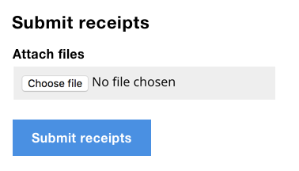
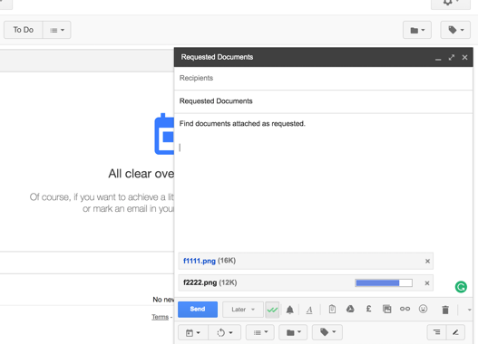
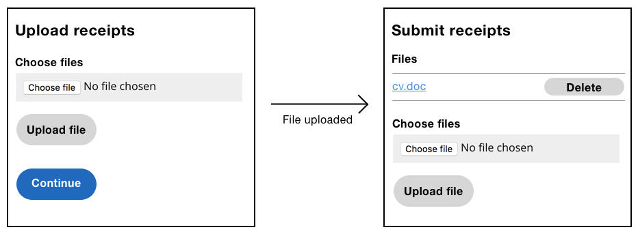
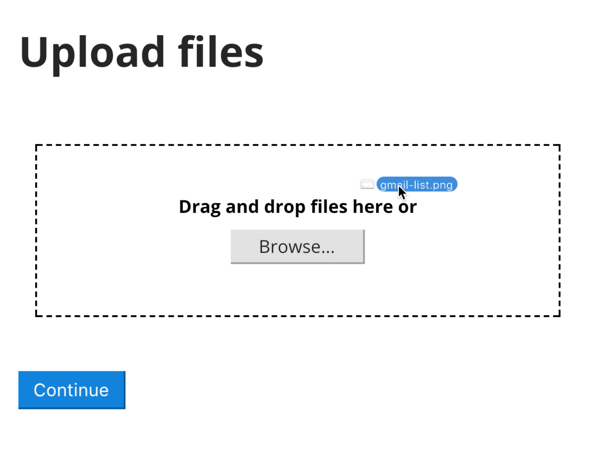
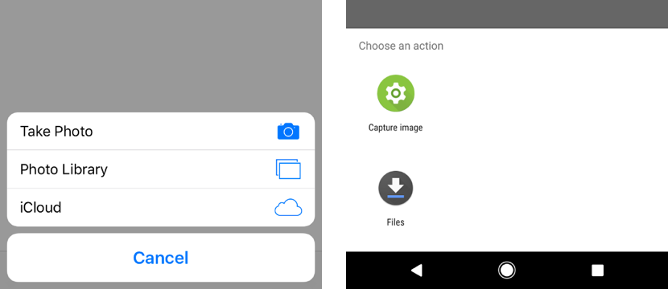

# An Upload Form

Some forms involve users having to upload files: documents, images or anything else really. On the one hand, uploading a file is only marginally more complex than inputting text or selecting options. On the other, there are some nuances and opportunites that need to be taken into account.

The problem increases by orders of magnitude as soon as users need to upload *multiple* files in one go.

## The File Picker

A file picker (`input type="file"`) is similar to most types of input. But instead of typing into it, the control spawns a dialog in which users can select a file from their computer or device. Mildly more complicated than a select box.


```HTML
<div class="field">
  <label for="documents">
  	<span class="label">Attach document</span>
  </label>
  <input class="field-file" type="file" id="documents" name="documents">
</div>
```

There's not much to see here. The component uses the same structure as many other form components. The only difference is the input's `type` attribute.

If users need to upload a single file, then you can add this field to your form and you're done.

### Aesthetics

Some designers like to restyle the file picker because it looks quite ugly. We know that *pretty and useless* is much worse than *ugly and useful*, but that doesn't mean beauty and aesthetics aren't important. Where possible we should marry the two together.

Styling file inputs is tricky because most browsers ignore any attempt at doing so with CSS. One approach is to visually hide the input, demarcating it solely via its label. Unlike file inputs, labels are easy to style.


Having hidden the input, and styled the label, Javascript should be used to handle focus states. When the input is focused, you should add a class to the input, so CSS can be used to give the appearance of being focused. When the user selects a file for upload, the `onchange` event updates the label text as shown.


On the face of it, this implementation is visually pleasing and it's still accessible. Keyboard and mouse users can operate it as normal and screen readers will announce the state of the input and associated label.

But operating the interface is not the only thing that needs consideration. This enhancement crumbles under further scrutiny.

First, updating the label to reflect the state is confusing because the label should describe the field and remain unchanged regardless of state. In this case, screen reader users will hear ‘some-file.pdf selected’ (or similar) as opposed to “Attach document”.

Second, the interface makes no allowances for a visual hint or error message which should be positioned inside the label, as set out in chapter 1, “A Registration Form”.

Third, file inputs let mouse users drag and drop files. The input itself acts as a “drop zone”, which some users may prefer. Hiding the input means jettisoning this functionality.

Any improvement to aesthetics just isn't worth the degradation in usability and utility.

## Multiple Files

Some tasks involve users uploading multiple files at once. One way to do this is to add the `multiple` attribute onto the input. Now, when the user activates the file picker dialog, the user can select multiple files.


This inocuous attribute grants a lot of power and seems to solve the multiple file problem in one fell swoop, but unfortunately it's not that simple.

First, users can only select files within a single folder. If they need to upload files within different folders they can't. Of course, users could move all the files into a single folder beforehand but this puts the onus on the user.

Second, some browsers don't recognise the `multiple` attribute. In this case it will degrade into a standard, single file picker, which could result in a broken experience. This may or may not be okay depending on your design.

For example, take the following form. It asks users to submit receipts. When the `multiple` attribute is supported, users can upload all the relevant receipts and submit. But when it's not supported, users can only upload a single receipt which may not be enough.



One way to solve this, is to ask users if they'd like to add another receipt as part of a flow. It also gives users the chance to review their submission. Crucially, this journey works whether the browser supports multiple or single file uploads. One potential downside is that it's long-winded - something that could be problematic if the form is used repeatedly.


## A Drag And Drop Enhancement

While file pickers let users drag and drop files onto the control there are two problems:

1. It's notimmediately obvious to uses they can do this
2. The drop zone is quite small making it harder to drop files, especially for motor-impaired users.

Creating a custom interface lets us solve both issues simultaneously.

### How It Might Look


The design - slightly biased toward mouse users - presents a large drop zone making it easier to use, especially for motor-impaired users. Inside the drop zone is instructional text that clarifies the behaviour.

Below the text sits a button. Really, it's a label *styled* as a button which is the technique I lambasted earlier. This only works because the label is a proxy for the input. Clicking the label behaves as if the file input was clicked - even if the input is visually hidden.

## Interaction

There's no submit button because the files are uploaded as soon as they're dropped. This is because browsers don't let you programmatically update a file input's value due to security reasons[^1]. 

The act of selecting a file (as opposed to dropping one) also uploads them immediately (`onchange`). This is so both interactions behave consistently within the same component.

The user can keep uploading documents either by dragging and dropping, or selecting, or using both interchangeably. When they're finished, they can review the files and if needed, delete them too. 

Clicking continue, takes the user to the next step, whatever that is. Gmail users, for example, upload files using a similar interface and clicking send. Essentially this is the same pattern with a different veneer.



*(Note: the technical constraints regarding security have driven us to abandon convention which is not without issues. I'll address this later.)*

### The Drop Zone

Here's the Javascript-enhanced mark-up:

```HTML
<form action="/upload" method="post" enctype="multipart/form-data">
	<div class="dropzone dropzone--enhanced">
		<div>
			<label for="files">
				Attach a file or drag and drop.
			</label>
			<input type="file" name="files" id="files" multiple>
		</div>
	</div>
</form>
```

The `enctype` attribute is necessary so that the files are transmitted to the server for processing. This is only relevant to the degraded experience. That is, when Javascript isn't available, users will see a file picker and upload button.



Keyboard users can tab to the visually hidden input which will pseudo focus the label with Javascript as described earlier. This is also the same technique used for the seat chooser interface as set out in chapter 3, “Book a flight”.

To create the drag and drop behaviour there are three javascript events: `ondragover`, `ondragleave` and `ondrop`.

The `ondragover` handler adds a class of `dropzone--dragover` and the `ondragleave` handler removes it. The class is used to give feedback so users know they are within the drop zone.



The `ondrop` handler is where the magic happens. The event handler receives an event object (`e.dataTransfer.files`) that holds data about the files. For each file dropped an AJAX request is made.

```JS
Dropzone.prototype.onDrop = function(e) {
	e.preventDefault();
	this.removeHighlight();
	this.upload(e.originalEvent.dataTransfer.files);
};
```

By default, dragging and dropping a file into the viewport will load the file in the browser which we prevent from happening on the firt line. Next, the highlight is removed. And finally, the `upload()` method is called passing in the dropped files. 

```JS
Dropzone.prototype.upload = function(files) {
    for(var i = 0; i < files.length; i++) {
      var formData = new FormData();
      formData.append('documents', files[i]);
      this.makeRequest(formData);
    }
    $('.fileList').removeClass('hidden');
  };
```

For each file dropped, we create the data using the `FormData` object. And then passing that data to `makeRequest`. Finally, the fileList component is revealed so that we can inject feedback.

### Feedback

Whether files are dropped or selected with the file picker, we need to give users feedback.

```JS
Dropzone.prototype.makeRequest = function(formData) {
  var li = $('<li>'+ formData.get('documents').name +'<br><progress value="0" max="100">0%</progress></li>');
  $('.fileList ul').append(li);
	$.ajax({
    url: '/ajax-upload',
    type: 'post',
    data: formData,
    xhr: function() {
      var xhr = new XMLHttpRequest();
      xhr.upload.addEventListener('progress', function(evt) {
        if (evt.lengthComputable) {
          // calculate the percentage of upload completed
          var percentComplete = evt.loaded / evt.total;
          percentComplete = parseInt(percentComplete * 100);

          li.find('progress').text(percentComplete + '%');
          li.find('progress')[0].value = percentComplete;
        }

      }, false);

      return xhr;
    }
  });
};
```

This function injects a list item into the file list panel and fires the request. It listens to the `progress` event on the `XMLHttpRequest` object, so that feedback can be given in real time. This is particularly useful if users are uploading large files or using a slow network (or both).

Each file is represented as a list item. Progress is demarcated by the `<progress>` element.


```HTML
<ul>
  <li>
    <span class="file">file.pdf</span>
    <progress max="100" value="80">80% complete</progress>
  </li>
  ...
</ul>
```

The text inside the element is for browsers that lack support for the progress element. They'll just see the text.

The progress bar is updated in response to the AJAX request that has an `onprogress` event.

When the file is finished uploading, the `<span>` is converted into a link so that it can be downloaded. Additionallity, a submit button is added, letting users delete the file if they uploaded it by mistake, for example.


```HTML
<ul>
	<li>
		<a href="/path/to/file.pdf">file.pdf</a>
		<progress max="100" value="100">100% complete</progress>
		<input type="submit" name="remove1" value="Remove">
	</li>
	...
</ul>
```

If there's an error, a message is shown in place of the progress bar, letting users dismiss that file to try again by clicking the button.


```HTML
<ul>
	<li>
		<a href="/path/to/file.pdf">file.pdf</a>
		<span class="error">File.pdf is too big.</span>
		<button type="button">Dismiss message</button>
	</li>
	...
</ul>
```

The only thing missing is a hidden live region in order to *provide a comparable experience* for screen readers. There are three scenarios that need to be announced:

1. The user starts uploading: “3 files are being uploaded”
2. The upload finishes successfully: “file.pdf has been uploaded”
3. The file couldn't be uploaded: “file.pdf couldn't be uploaded because it was too big”

These messages are only needed for screen reader users, and so they should be placed inside a hidden live region:

```HTML
<div class="vh" role="status" aria-live="polite">
	3 files are being uploaded
</div>
```

### Feature Detection

This enhancement uses several Javascript APIs that not all browsers recognise. Before referencing them, they need to be detected to ensure users don't get a broken experience.

```JS
(function() {
	var dragAndDropSupported = (function() {
		var div = document.createElement('div');
		return ('draggable' in div) || ('ondragstart' in div && 'ondrop' in div);
	}());

	var formDataSupported = (typeof Formdata == 'function');

	var fileReaderSupported = (typeof FileReader == 'function');

	if(dragAndDropSupported && formDataSupported && fileReaderSupported) {
		// Define Dropzone code here
	}
}());
```

The calling application simply detects `Dropzone` before creating an instant. When it's undefined, that indicates the browser either lacks support or there was a network failure. Either way, users get the degraded, but not broken, experience.

```JS
if(typeof Dropzone !== 'undefined') {
  new Dropzone();
}
```

### The Small Print

As noted earlier, we're breaking convention by uploading files immediately `ondrop` and `onchange`. And while there's rationale behind the approach, doing so actually goes against WCAG guidelines, as first discussed in chapter 5, “An Inbox”. Here it is again:

> Changing the setting of any user interface component does not automatically cause a change of context.

In plain terms, updating a from control, shouldn't do anything else. You need a separate action (submit) for that.

This isn't just an academic endeavour. The `onchange` event is historically problematic, particularly when it's applied to a file input. For example, in some browsers, if you upload the same file (or a file with the same name) for a second time, the `onchange` event won't fire at all[^2]. This would create a broken experience.

The solution is to replace the entire file input after the `onchange` event fires. This would mean having to set focus to the cloned file input, which causes screen readers to announce it for a second time. Mildly annoying.

The other problem is that some older browsers, won't fire the `onchange` event until blurring the field[^3]. Fortunately, the feature detection rules out those browsers which is fortunate.

Lastly, some older browsers won't trigger the file input by clicking the label[^4]. Once again, the feature detection rules out these browsers too.

Anything like this needs a a lot of diverse testing to ensure what is better for some, doesn't exclude others. As you can see, going against WCAG guidelines can, if we're not careful, lead to usability failures.

It's also worth baring in mind that users may not want, or benefit, from drag and drop at all. Before embarking on your own drag and drop solution, make sure there is a user need.

## A Note About The `accept` and `capture` Attributes

The file input offers two interesting attributes that affect the experience of uploading files: `accept` and `capture`.

The `accept` attribute takes a hint or mime type. When supported, the browser/device may offer users an optimised interface in which to choose files. 

```HTML
<input type="file" accept="image/*">
```

In Chrome and Safari on iOS and Android, for example, it will give the user a choice of which app to use to capture the image, including the option of taking a photo with the camera or choosing an existing image file.



*(Note: On desktop it will prompt the user to upload an image file from the file system disabling files that aren't images, for example. The problem with this is that users won't know why the files are disabled as there's no feedback.)*

You can also add the `capture` attribute, which indicates to supporting browsers that you prefer getting an image from the camera:

```HTML
<input type="file" accept="image/*" capture>
<input type="file" accept="image/*" capture="user">
<input type="file" accept="image/*" capture="environment">
```

Adding the capture attribute without a value let's the browser decide which camera to use (if there's one available), while the "user" and "environment" values tell the browser to prefer the front and rear cameras, respectively.

The capture attribute works on Android and iOS, but is ignored on desktop. Be aware, however, that on Android this means that the user will no longer have the option of choosing an existing picture. The system camera app will be started directly, instead which is probably undesirable.

## Summary

In this chapter, we looked at the intricacies of uploading files - not just one at a time, in bulk. 

We looked at ways to mitigate the file input's ugliness, but soon realised that making it look better is at the cost of usability.

Finally, we lookat ways to enhance the native file input's drag and drop behaviour by creating a large custom drop zone. To do that we used various modern Javascript APIs that meant breaking convention due to security constraints.

### Things To Avoid

- Visually hiding the file input for aesthetic reasons.
- Using multiple file inputs without considering the degraded experience and end-to-end flow.
- Creating a drag and drop solution without first ensuring there's a need for it.

## Footnotes

[^1]: https://css-tricks.com/drag-and-drop-file-uploading/#article-header-id-4
[^2]: https://stackoverflow.com/questions/12030686/html-input-file-selection-event-not-firing-upon-selecting-the-same-file
[^3]: https://stackoverflow.com/questions/2389341/jquery-change-event-to-input-file-on-ie
[^4]: https://stackoverflow.com/questions/2389341/jquery-change-event-to-input-file-on-ie