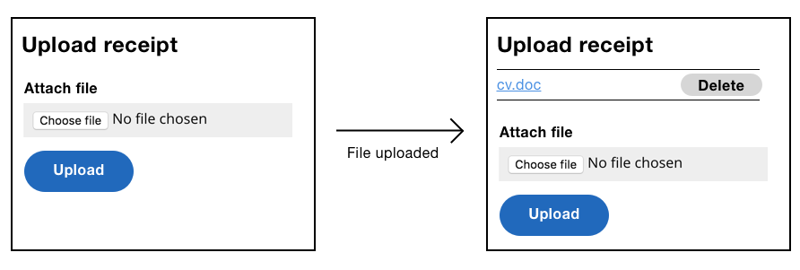
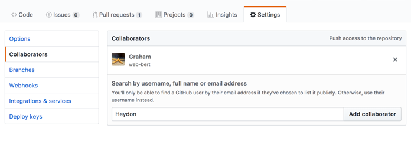

# An Expense Form

As a freelancer I have to submit expenses for my tax return. It’s a pain but if I do it correctly I get tax breaks. The problem is that I have so many expenses to enter and a limited amount of time to enter them.

The anatomy of an expense depends on the system you use and perhaps the country you live in. It might include a description, company, date, amount and proof of purchase. How can we design a form that makes inputting multiple entries easy, fast, performant and inclusive?

Of course, if you know how many entries are needed in advance, then give users a form with that many fields, make them required and that's about it. But if we don't how many entries are needed in advance (like expenses), keep reading.

## The Persistent Form Pattern (Again)

In the previous chapter, I introduced the persistent form pattern. In short, we gave users an upload form, which users can keep using until they've finished uploading as many files as they need. At which point they can proceed or exit the page—whichever is most appropriate for the specific problem at hand.



There are a number of other forms on the web that use the persistent form pattern. For example, Github's *add collaborators* form. In fact, the infamous Todo List[^] form that makes up many JavaScript tutorials is another example.



This pattern works for adding expenses too. Each time the user submits an expense, it will be added to the list above.


This pattern is well-suited to short, simple forms that can be submitted in one go. The pattern does, however, have a number of downsides:

1. Users might need to use a form that has dynamic questions (branching) that are conditionally shown based on previous answers. In this case, the pattern doesn't work so well. We'll look at branching in more detail shortly.
2. As the list of added expenses grow, the form moves further down the page. This could be a problem, especially on mobile, as users would have to scroll down to see and use the form.
3. Having multiple calls to action (to submit and to proceed or exit) might be confusing, especially for cognitively-impaired users. Where possible, one call to action is preferrable as it requires less thinking.
4. Each submission requires a separate request to the server. This could be frustrating, where lots of entries need to be added.

## Branching With One Thing Per Page

One of the major problems with the persistent form pattern is that it can't handle branching. Branching involves users being asked different questions depending on the previous answers.

For example, if users are expensing a car, they'll need to enter mileage; if they're expensing a train ticket, then they'll need to enter its price.


In this case, the One Thing Per Page pattern (as first discussed in “A Checkout Flow”) is more suitable. This is because it presents one question at time meaning we can send users to different pages depending on the previous answers. This solves the branching problem elegantly and simply, but, what if users also need to enter many expenses and submit them in one go? 

To guide users to the end of the journey, once they've created one expense, we can ask them if they'd like to add another one. Selecting *Yes* would take the user down the same flow again. Selecting *No* would complete the task.


The downside to this pattern, in this context, is that it's long winded in comparison to the persistent form pattern. Let's have a look at a third pattern.

## The Add Another Pattern

Both the Persistent Form pattern and the One Thing Per Page pattern suffer from the same problem—that each expense created required at least one trip to the server, which is slow. How might we solve this problem?

The Add Another pattern works by giving users a single form, on a single page, submitted in a single step. However, the user can keep adding fields for how ever many expenses they need to add. For demonstration purposes, lets simplify the anatomy of an expense down to just a description and cost.

### How It Works


The form starts with enough fields to enter one expense. However, there's an Add Another button, that when pressed, will instantly clone the fields so that users can enter the details of an additional expense.

Users can keep on doing this until they're done, at which point the user is able to submit all their expenses at once, with just a single trip to the server—speeding up the process drastically.

*(Note: the basic experience (before adding the JavaScript enhancement), works the same way except that pressing the Add Another button will generate the new fields on the server.)*

### The Basic Mark-Up

```
<form>
  <div class="addAnother">
    <div class="addAnother-item">
      <div class="field">
        <label for="items[0][description]">
          <span class="field-label">Description</span>
        </label>
        <input 
          type="text" 
          id="items[0][description]" 
          name="items[0][description]">
      </div>
      <div class="field">
        <label for="items[0][amount]">
          <span class="field-label">Amount</span>
        </label>
        <input 
          type="text" 
          id="items[0][amount]" 
          name="items[0][amount]">
      </div>
    </div>
    <input type="submit" name="addAnother" value="Add another expense">
  </div>
  <input type="submit" name="submitexpenses" value="Submit expenses">
</form>
```

There are two important notes about this form:

1. The expense fields are wrapped in a `<div class="addAnother-item">`. This lets us target the expense with CSS and JavaScript (explained shortly).
2. The inputs `name` and `id` attributes have a special-array like naming convention, which we'll discuss now.

### Processing Multiple (Dynamic) Expenses

When the form is submitted, the payload will consist of multiple expenses. The server will need to process this data, but it won't know how many expenses will be sent in advance. That is, the expenses are dynamic.

To help the server recognise and process the submitted expenses, a contract must be made between the client and the server. When it comes to forms, the contract is forged by the `name` attribute.

```HTML
<input type="text" name="items[0][description]">
<input type="text" name="items[0][amount]">
```

Note the special `name` attribute value. By formatting it this way, the request payload can be parsed and converted into an array of expenses that the server can process easily. Several server-side frameworks, such as Express[^], are designed to recognise this convention. Let's run through the each part and describe what it means.

- *items* is the name of the group. You can use whatever name you like.
- *[0]* represents the number of the item. This number will increment by one for each individual expense.
- *[description]* and *[amount]* represents the specific attributes about the expense. In this case, the description and the amount. For each unique attribute you want to store, you'll need a unique name to identify it.

### Cloning Fields

Pressing the Add Another button needs to create a new set of expense fields to the form. There are several ways we might go about doing this. For example, we might using templating, stored either in JavaScript[^] or in HTML[^]. The downside to these approaches mostly comes down to support.

There's a simple alternative that solves this problem: cloning. This involves making a copy of the already-existing expense fields and changing the name and id attributes.


---

If we don't update the label's `for` attribute and the matching input's `id` attribute, when the user clicks the label, focus will be moved to the first field.


Crucially, if you don't update the `name` attribute, the server won't be able to recognise and process the submitted data. Remember: the contract between the browser and the server is forged by the `name` of the form controls.

The `id`, `for` and `name` attributes have a particular format. This is because we're sending the server multiple expense items for processing. Many server-side frameworks, such as Express, look for names with array indexes in the request payload. They use this convention to convert the form fields and values into groups.

The important bit is that the index needs to increase by 1 each time. To make this easy to parse in Javascript, the pattern is stored in data attributes. This way, all the script has to do is replace `%index%` with the index number.

```JS
el.name = $(el).attr('data-name').replace(/%index%/, index);
```

The reason there are attributes for `id` and `name` is that in the case of radio buttons and checkboxes, the `name` differs from the `id`. As laid out in, chapter 2, “A Checkout Flow”, the name of each radio button is the same, but the id need to be unique of course.

While this pattern is more complex, it may speed up the task for users who are more confident and familiar with a particular system which is used frequently.

---

### Managing Focus

When the add button is clicked, focus should be set to the first newly-created form field. This is useful for screen reader users too, as the announcement of that field naturally prompts the user to continue.

When the user clicks the remove button, the fields in the row, including the button itself are removed. What happens to the focus when you delete the currently focused element? In “A Todo List”[^2], Heydon Pickering explains exactly what happens:

> [...] browsers don’t know where to place focus when it has been destroyed in this way. Some maintain a sort of “ghost” focus where the item used to exist, while others jump to focus the next focusable element. Some flip out completely and default to focusing the outer document — meaning keyboard users have to crawl [...] back to where the removed element was.

So we don't want to leave focus down to the browser but where do we move it to? 

We could set focus to the previous or next expense item but this is confusing. Alternatively, we could set focus to the add another button, but that's both presumptuous and a little odd.

Instead, we should set focus to the heading at the beginning of the form. WHY????

### Feedback

For most users, feedback is given implicitly by the new fields appearing in the form. There's no need to show an additional notification at the top of the form, for example. Having two parts of the interface update at the same time would be overbearing. And, as more expenses are added, the notification would be outside the viewport, meaning uses wouldn't see it anyway.

For screen reader users, the act of focusing the new field will announce its label.

The only remaining consideration would be animation. Perhaps by fading-in the new fields, the chance of the fields being missed is reduced. However, motion is often unnecessary, clunky and harmful to users, especially those suffering from cognitive impairements such as ADHD and Autism.

> ADHD: If there's a “subtle” animation always running, I cannot focus. — @tigt_

> I'm also autistic and can get frustrated with, or repelled by, glitzy mouseover effects/animations - @elementnumber46

### Multiple Submit Buttons

- Pressing enter
- add button to top

## Summary

In this chapter, we've looked at the different ways to let users add multiple expenses or any other type of information that needs to be included. The patterns are based on frequency of use, digital literacy and whether there is a need to branch.

There's no right and wrong way here, it's about picking the most appropriate pattern for your particular problem.

## Checklist

-
-
-

## Demos

TBD

## Footnotes

[^1]: http://todomvc.com/
[^2]: https://inclusive-components.design/a-todo-list/