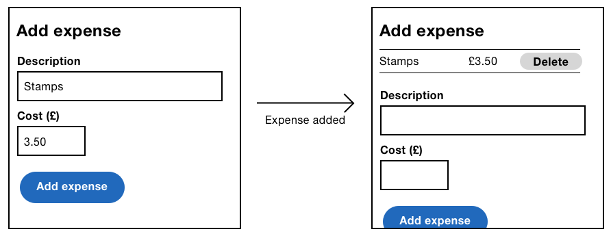
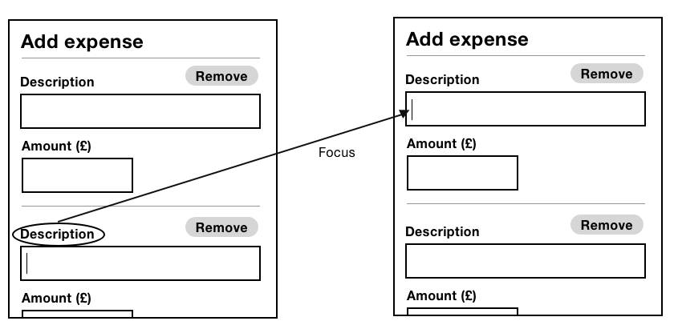

# An Expense Form

As a freelancer I have to submit expenses for my tax return. It’s a pain but if I do it correctly I get tax breaks. The problem is that I have so many expenses to enter and a limited amount of time to enter them.

The anatomy of an expense depends on the system you use and perhaps the country you live in. It might include a description, company, date, amount and proof of purchase. How can we design a form that makes inputting multiple entries easy, fast, performant and inclusive?

Of course, if you know how many entries are needed in advance, then give users a form with that many fields, make them required and that's about it. But if we don't how many entries are needed in advance (like expenses), keep reading.

## The Persistent Form Pattern (Again)

In the previous chapter, I introduced the persistent form pattern. In the chapter, we gave users an upload form, which users can keep using until they've finished uploading as many files as they need. At which point they can they can proceed or exit the page—depending on what you need.


There are a number of other forms on the web that use the persistent form pattern. For example, Github's *add collaborators* form. In fact, the infamous Todo List[^] form that makes up many JavaScript tutorials is another example.


This pattern works for adding expenses too. Each time the user submits an expense, it will be added to the list above.



This pattern is well-suited to short, simple forms that can be submitted in one go. The pattern does, however, have a number of downsides:

1. Users might need to use a form that has dynamic questions (branching) that are conditionally shown based on previous answers. In this case, the pattern doesn't work so well. We'll look at branching in more detail shortly.
2. As the list of added expenses grow, the form moves further down the page. This could be a problem, especially on mobile, as users would have to scroll down to see and use the form.
3. Having multiple calls to action (to submit and to proceed or exit) might be confusing, especially for cognitively-impaired users. Where possible, one call to action is preferrable as it requires less thinking.
4. Each submission requires a separate request to the server. This is slow and could become frustrating if the user needs to add a lot of entries.

## Branching With One Thing Per Page

One of the major problems with the persistent form pattern is that it can't handle branching. Imagine the information the user needs to enter changes based on the type of expense. For example, if they're expensing a car, they must enter mileage; if they're expensing a train ticket, then they must enter the price.


In this case, the One Thing Per Page pattern (as first discussed in “A Checkout Flow”) is more suitable. This is because it presents one question at time meaning we can send users to different pages depending on the answer to the previous question. This solves the branching problem elegantly and simply.

But, what if users also need to enter many expenses and submit them in one go? To guide users, we can ask them if they'd like to add another expense at the end of the flow. Selecting *Yes* would take the user down the same flow again. Selecting *No* would complete the task.


The downside to this pattern in this context is that it's long winded in comparison to the persistent form pattern.

## Add Another

- why
- How It Might look
- The Basic Experience
- Adding an item
- Removing an item
- Feedback
- Multiple submit buttons (add to top)

## The Add Another Pattern

If your interface needs to be used more frequently and doesn't need to branch, you can consider the Add Another pattern. This consists of a single form, on a single page, submitted in a single step.

It works by using Javascript to create extra form fields instantaneously which expedites the process.

### How It Might Look


Clicking the add another button creates a new set of expense fields. Pressing the remove button deletes the field. Users keep adding expenses and when they're finished, they can submit all of the expenses in one go.

The degraded experience is the same, except clicking a button refreshes the page.

### Managing Focus

When the add button is clicked, focus should be set to the first newly-created form field. This is useful for screen reader users too, as the announcement of that field naturally prompts the user to continue.

When the user clicks the remove button, the fields in the row, including the button itself are removed. What happens to the focus when you delete the currently focused element? In “A Todo List”[^2], Heydon Pickering explains exactly what happens:

> [...] browsers don’t know where to place focus when it has been destroyed in this way. Some maintain a sort of “ghost” focus where the item used to exist, while others jump to focus the next focusable element. Some flip out completely and default to focusing the outer document — meaning keyboard users have to crawl [...] back to where the removed element was.

So we don't want to leave focus down to the browser but where do we move it to? 

We could set focus to the previous or next expense item but this is confusing. Alternatively, we could set focus to the add another button, but that's both presumptuous and a little odd.

Instead, we should set focus to the heading at the beginning of the form.

### Feedback

For most users, feedback is given implicitly by the new fields appearing in the form. There's no need to show an additional notification at the top of the form, for example. Having two parts of the interface update at the same time would be overbearing. And, as more expenses are added, the notification would be outside the viewport, meaning uses wouldn't see it anyway.

For screen reader users, the act of focusing the new field will announce its label (or legend).

The only remaining consideration would be animation. Perhaps by fading-in the new fields, the chance of the fields being missed is reduced. However, motion is often unnecessary, clunky and harmful to users, especially those suffering from cognitive impairements such as ADHD and Autism.

> ADHD: If there's a “subtle” animation always running, I cannot focus. — @tigt_

> I'm also autistic and can get frustrated with, or repelled by, glitzy mouseover effects/animations - @elementnumber46

### Cloning Explained

Every time the user adds or removes an item, we need to do some important work behind the scenes. Cloning works by taking the first item in the list, and cloning it. But this isn't enough on its own because this clones everything: `id` and `name` attributes included.

If we don't update the label's `for` attribute and the matching input's `id` attribute, when the user clicks the label, focus will be moved to the first field.



Crucially, if you don't update the `name` attribute, the server won't be able to recognise and process the submitted data. Remember: the contract between the browser and the server is forged by the `name` of the form controls.

```HTML
<form class="addAnother">
  <div class="addAnother-items">
    <div class="addAnother-item">
  	  <div class="field">
        <label for="items[0][description]">
		      <span class="field-label">Description</span>
	      </label>
        <input class="field-textBox" type="text" id="items[0][description]" name="items[0][description]" value="" data-name="items[%index%][description]" data-id="items[%index%][description]">
      </div>
      <div class="field">
        <label for="items[0][amount]">
          <span class="field-label">Amount</span>
        </label>
        <input class="field-textBox" type="text" id="items[0][amount]" name="items[0][amount]" value="" data-name="items[%index%][amount]" data-id="items[%index%][amount]">
      </div>
      <input type="submit" name="remove" value="Remove expense">
    </div>
    <input type="submit" name="addAnother" value="Add another expense">
  </div>
</form>
```

The `id`, `for` and `name` attributes have a particular format. This is because we're sending the server multiple expense items for processing. Many server-side frameworks, such as Express, look for names with array indexes in the request payload. They use this convention to convert the form fields and values into groups.

The important bit is that the index needs to increase by 1 each time. To make this easy to parse in Javascript, the pattern is stored in data attributes. This way, all the script has to do is replace `%index%` with the index number.

```JS
el.name = $(el).attr('data-name').replace(/%index%/, index);
```

The reason there are attributes for `id` and `name` is that in the case of radio buttons and checkboxes, the `name` differs from the `id`. As laid out in, chapter 2, “A Checkout Flow”, the name of each radio button is the same, but the id need to be unique of course.

While this pattern is more complex, it may speed up the task for users who are more confident and familiar with a particular system which is used frequently.

## Summary

In this chapter, we've looked at the different ways to let users add multiple expenses or any other type of information that needs to be included. The patterns are based on frequency of use, digital ability and whether there is a need to branch.

There's no right and wrong way here, it's about picking the most appropriate pattern for your particular problem.

## Checklist

-
-
-

## Demos

TBD

## Footnotes

[^1]: http://todomvc.com/
[^2]: https://inclusive-components.design/a-todo-list/